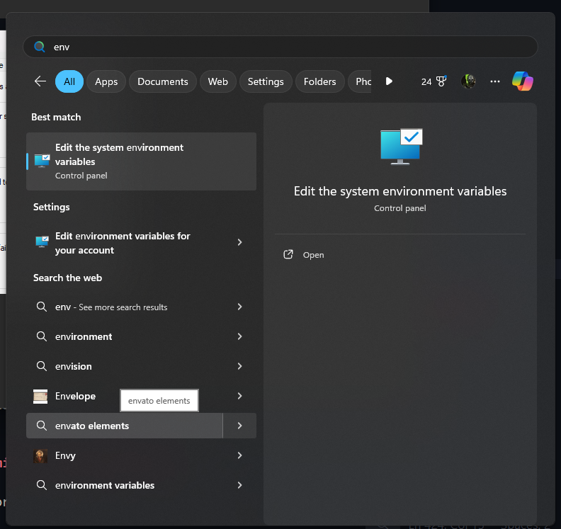
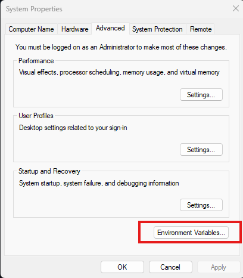
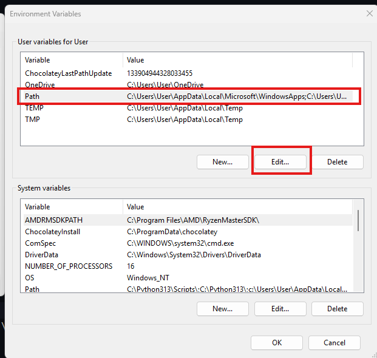
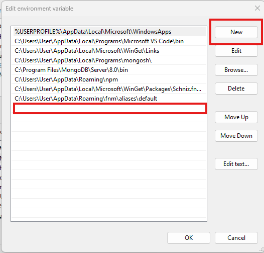
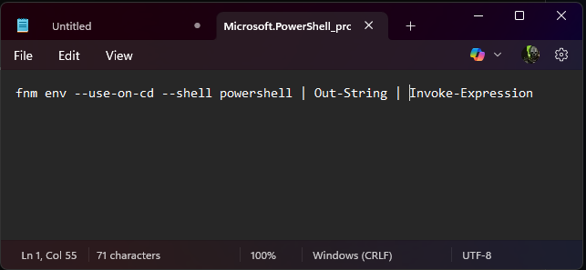

# MODULE-12: EXPLORE-THE-FUNDAMENTAL-OF-NODEJS

Welcome to the new mission, today we pull back the curtain on how the web truly works and introduce you to the powerful world of Node.js! 🌐

In this module, you'll gain a solid understanding of the internet’s backbone—from how a browser talks to a server, to the difference between frontend and backend, and why Node.js is a game-changer in modern development.

We’ll explore:

The magic of the event loop 🌀 and how Node.js handles millions of requests without breaking a sweat,
The single-threaded nature of Node.js and how it still manages to stay lightning fast ⚡,
How to install Node.js like a pro using fnm (no more versioning nightmares!),
And master the modular system that makes Node.js both clean and powerful—CommonJS, ES Modules, IIFE, index exports—you’ll cover it all!

By the end of this module, you’ll not only understand the “what” but the “why” behind Node.js and how it's structured to be efficient, modular, and scalable. Whether you're building APIs, tools, or full-stack apps, these concepts will level up your backend journey in no time.

Node.JS Documentation: https://nodejs.org/en/learn/getting-started/introduction-to-nodejs

Let’s get started and unlock the server-side superpowers of JavaScript! 💪

## 12-1 How the web works

After hitting a url we can see a data in our ui. Request can come from web browses or mobile app.

- First of all a client sends request to `server` and then in return server sends us the response with the data or the error. This is called `Request Response Model` or `Client-Server Architecture`.


- There are some rules of happening request and response to the server.


1. **Protocol :** `https://` or `http://` is called `Protocol`. This means the rules or regulation. By this we are setting a rules that in which protocol the client server connection will be maintained, i mean by maintaining which protocol the data transfer will happen between client and server.
2. **Domain Name:** This is the actual website name.
3. **Resource :** This means By going to the domain where we want to go or what we want to see. we can Compare with a home. Domain name is the home and the resources are like which room is whose or in which room we will get the specific data contained by the room.

- Domain name is not the real address of a website. It like we are giving a name to our home like House#20, This name is not the actual address of the place. Actual name is named by government.
- And this kind of actual name of the domain name is `ip address`. Where the ip address is written is called `DNS Server`.
- `DNS server` is like a government directory where the plot information are saved and our given name of the home does not holds the plot information. In the same way `IP Addresses` Are saved in the `DNS Server`.


- When we hit a `domain name` or URL from client browser the it sees in `DNS Server` that if any `ip address` is available matching to the domain name. If available the dns server give the ip address to the browser. `IP address` Works Under Th hood of domain name.Server do not even know the domain name.
- The matching IP address is the expected `server` address. request is sent to the server ip and the server send response with data.


- When the connection between the server and the client is building the protocol is called `TCP/ IP SOCKET CONNECTION`. these are rules and regulation of the connection.
- `TCP` means the transmission control protocol. and `IP` means internet protocol.
- The protocols are must to maintained while doing connection.
- the process is like after `HTTP Request` the `TCP/ IP SOCKET CONNECTION` is built and then the `HTTP Response` is sent.

#### Lets Summarize the Process.


- We will send `request` to server from client side using some `methods` like `GET`, `DELETE`, `PUT`, `PATCH`, `POST`.
- Request holds some `request headers` like `HOST: www.sazid.com`, `Accept-Encoding : gzip, deflate, br, zstd`, `Cookies`
- When we want to create update a data or create a data we have to give the data inside the `Request Body`
- after the HTTP Request the server will give us a `response` with `status code`, `message`.
- Response also holds a `response header` response header hold the `Access-Control-Allow-Credentials: true` `Content-Type :text/plain`.
- Response body shows the the data we have asked for after http request.

## 12-2 Frontend vs Backend Development

### lets understand Wast is frontend

- Normally We work with UI and this is frontend development
- Client/browser is needed for frontend
- frontend ui can be built on different technologies like angular, vue or react/next.js
- No matter what we use for building ui ultimately converted to HTML, CSS AND JS since browser only understand these

### Lets understand What is backend

- when the work is building logic, playing with data, calculation or computational related works.
- Server is required for backend development
- In backend we can use different languages like php, rails python,java,js.
- We are not running the backend in browser, we can think like that backend itself is a computer and can run any language.
- Now a days we can use `node.js` as backend, Its javascript runtime now.
- js was made for frontend or browser related works. This was not made to write backend code. This lacking was filled by node.js run time. now we can wite backend code using js as well.
- Node.js is not a programming language. Js is a programming language and node.js(js run time) made a way for js to write code for backend.
- Other language like php, rails python,java these are self sufficient so that they do not need any others help to be able to be used for writing backend code.

  

- Data are kept in backend as files. after a request to server server takes the files from backend and deliver to frontend.
- Other option is server can communicate with our database and serves processed data from database after a successful request. this is why backend is called an application.

### Two Types of Scenario Can Happen

#### Static Website

- In Previous day we used to store html, css js files like image videos were stored in backend `server`.
- Inside the backend server we were used to create a page and the copy of the page was used be sent to frontend.
- Frontend used to show the copy of the page created in backend like pre made food.

#### Dynamic Website

- Here pages are not pre made in server.
- In case of Dynamic Website when a request comes from client side, All the required data comes from `Database`.
- Required data comes to server from database.

- Then the server uses some templates like `HBS`, `PUG`, `EJS` (These are Template engine for making page) to build the page using the data came from database and then the page is sent to browser using server and shown to frontend. **This is Called Server side Rendering(SSR)**


**Now Lets See Client side Rendering(CSR) in dynamic Website**

- Another method is we can see the data in frontend using api.
- when request comes from client side then server will request the data from database and gets the data
- Then server modifies the data according to our requirement and send to browser
- Remember that here browser is just getting the raw data i mean no html css and js and others like images, browser is just getting the json data.
- Now the Browser is building the site using the data and the html css coming from frontend technology.
- The page can be build using any kind of frontend library like react, vue, angular etc.


#### What are the benefits of Using API?

- When json data is coming from backend to frontend then it will support `CROSS` Device or platform.
- Can be seen in mobile browser UI, Desktop Browser UI, Desktop application or Mobile application.
- On the other hand the static website is like we have to make it for each and every device and platform. this is a hassle. So, east or west dynamic is the best.


- Moreover API built site is also better than the server side rendering since if we use template engine to make page they should be made different for each app and each platform as well and this is time consuming our time to build a site.
- The best solution is use api and build in browser side using frontend library so that each and every device can access.

## 12-3 Why Node.js was invented

- HTML Gave us the structure of a website, CSS gave us the styling and JS made the website interactive.
- js runs in our browser using js engines like
  1. chrome ---> V8 Engine (Best Performance)
  2. Firefox ---> Spider Monkey
  3. Safari ---> JavascriptCore

#### Now Lets See How Js Works

- When we write a js code it is converted to a `Abstract Syntax Tree` Using a `Parser`.
- The Tree is interpreted (what is written we understand) using a `Interpreter`.
- Then the code is compiled using a compiler. This compiler is called Just in time compiler. Using the compiler we see the output.


#### Now Lets See How is Js Under Th Hood.

- We have `call stack` where the functions are kept
- We have `Heap` where is memory management is done
- Then we have `Web Api`, `Dom` , `Fetch API`, `Callback Que (timers, click events)`


- We know js only runs in browser, we can not write js in server.
- Then people came up with an idea that lets make Js Universal. I mean they have made node js that helps us to write js in server.
- Node,js is basically a js run time that helps to run js in server.
- Node.js was made based on c++ and v8 engine.
- We can not write raw js without using node.js in server since js only gets the browser dom access where other language gets the full computer access like file system, networking and all. these gaps are filled by node.js

#### Why Node.js is popular?

1. We can use js on server side.
2. Build Highly Scalable backend application.
3. It is single threaded, event driven and works on non blocking i/o.
4. Perfect for building data intensive streaming application.

#### Cons Of Node.js

- It can not perform Highly CPU Intensive tasks
- But now a days we can do highly cpu intensive tasks using worker threads.

#### Dependencies of Node.js

1. **V8 Engine :** Node.js runtime is based on v8 engine written in c++ and js. without v8 engine node js would never understand js code. Its most important dependency of node.js
2. **Libuv :** It is a open source library written on c++ which focuses on `asynchronous I/O` and gives node access to `COMPUTER OS`, `FILE SYSTEM`, `NETWORKING` etc.

#### **Libuv** Has two important parts

- **Event loop :**

  1. executes callback functions,
  2. Network I/o

- **Thread Pool :**

  1. Cpu Intensive tasks,
  2. File Access,
  3. File Compression,
  4. Cryptography

- Node.js transfers the intensive tasks to thread pool so that it takes less memory to make a task done.

#### Overall

- node.js is combination of v8 engine and Libuv. arther than these node.js has http-parser, c-areas, zlib, openssl.
- We will write pure js code and then the node.js will make it run in server.

## 12-4 High Level Overview of Node.js Architecture

#### Event Driven Architecture

Node.js core modules each are events

[Node.js Events API](https://nodejs.org/docs/latest/api/events.html)

- Flow : Cousin sent to shop to buy a chips. he will come back and call me that "vaiyya chips ansi"
- Event Emitter is like different kind of http request or any client side request. These requests are listened by node.js using event listener.
- Event Emitter(special type of instance object ) -->Event Listener --> CallaBack.
- The thing happening here is emitter will be emitting and event listener will listen and call the callback
- Callback function is a response against the event.


- This total work is handled in node.js using `event loop` which is the heart of the Node.js which makes the asynchronous programming possible in Node.js. Most of the tasks of node js are handled by event loop.

#### Before Understanding the event Loop lets understand two things.

1. **Process :**

   - Program : A program Contains a set of instructions
   - Disk : The program is written inside a disk.
   - Ram: When we want to run the program we have to load this in RAM. Ram prepares then program for running. and this is called process.

   

   - Initially the process is just some set of instructions which are not executable. To run the program the instructions must have to come to an environment or situation and this is called process and this happens in our ram.
   - Process needs resources to run.
   - Primary resources is ram, and other resources are CPU, GPU, I/O and all these are controlled by operation systems

   

   - Process holds more things like `Processor Register`, `Program Counter`, `Stack Counter`, `Memory`.
   - Binding these resources a process is building.

   

   - There might be multiple processes each build using `Code`, `Data`, `Stack`, `Heap`
   - The processes's environments are different from others.
   - Ram Runs the processes separately.

2. **Threads :**

- Threads are unite of executions
- Suppose we want to execute the process in our ram. The process do not execute at a time. The process is executed unit by unit.
- Each and every units are called threads.


- Thread Contains `Stack`, `Register`, `Program Counter`
- Thread can be single threaded or multi threaded.

#### Now Lets Understand the Node.js Run time Process

- **Node.js Runtime itself is a process** since node.js is giving js the power of running js code in server. or we can say making an environment. and we can access process variable
- Node.js is a **Single Threaded Run Time**. This means it will execute one unite at a time and one by one it will execute others.
- First of all the `Program File Initialization` is done.
- Then `Top Level Code Execution` is done of my program (Codes that are out of main Functions).
- `Require Module` is done the. This means To run my code which modules or codes are required it will be imported.
- `Register Callback Events` this means the events or callback based on those we will get response those will be registered for execution. remember the execution will not be done her one the registration of the cal back functions will be done here.
- Finally The event loops will be running and the callback functions will start to execute.
- While any heavy tasks is found the event loop transfers the heavy tasks to thread pool.
- Thread pool contains a lot of worker threads.a nd these worker threads do the heavy computational tasks and in return he inform the event loop that the work has been done.
- Then the event loop shows the task result.

#### Event Loop works

It is a the heart of Node.js which makes the asynchronous programming possible in node.js

1. Most task of node.js happens in Event Loop. only heavy tasks are sent to thread pool.
2. Received events and execute callback associated with each callback function
3. Offloads CPU Intensive tasks.

- Suppose 1st user is requiring data -> **single threaded event loop will give the data directly**
- Second user wants to read file (synchronously - this is not possible have to be asynchronous to make thread pool work ) -> **This is a heavy task so 3rd and 4th user works will be locked. this is a problem. and the problem is solved thread pool** after using the thread pool third and 4th person work is not blocking its happening in parallel while thread pool working with 2nd person work
- Third person want to do a query
- 4th user is requiring data


- This is how event driven architecture and this is how being a single threaded the node.js works asynchronously perform different tasks

## 12-5 Single threaded node.js

#### Single Threaded Server Vs Multi Threaded Server

- We used to keep server and client in one place. Html css js all are used to keep in server.
- In modern days application we keep the server completely separate from client.
- As we are keeping the server separate we are getting compatibility like it will support Cross device. data will be safe for all device and platform.


##### Server can have two type of task

1. **I/O Intensive Task :** It like we request something and get something
2. **CPU Intensive Task :** Heavy Calculations are done here.

##### Multi Threaded

- In previous days the languages used for server most of the cases were multi threaded and servers were also multi threaded.
- Multi threaded server can perform different tasks at a time in parallel. one task do not stop for another each and evry works independently.


##### Multi Threaded Server has some limitations

- Suppose our server has 10 thread. it can handle 10 tasks operation at a time but when the there comes 11th task or more it cant handle after 10 since it has 10 threated. 1th no task have to wait until any thread gets free.

- to solve the limitations of multi thread we could use two methods
  1. **Horizontal Scaling :** : This means we could create instance from the server and set multiple server. By increasing the server number we could increase the number of threads.
  2. **Vertical Scaling :**I can upgrade cpu ram to upgrade server power or we can say increasing the core. By increasing the core we can increase the thread number.


- These are increasing the thread but costing more since we have to create server we need more cpu and more.

#### **Node.js** Come here with a magic of **handling multiple request** despite being a single threaded.

- One thread means at a time it can perform one operation. this is a problem right? another client has to wait until first operation is completed.
- BOOOM !! Node.js gives us a Magic named Worker pool/thread. When I/O operation comes server send the task to thread pool and the operation will be going on in thread pool. worker threads of thread pool does all the works and then sends to them who has requested. if another requests comes in parallel time it do do not have to wait because it will be sent to thread pool and the co worker will be doing the tasks in parallel. after performing the task thread pool lets the server know that the task is done.
- The non blocking behavior is called non blocking I/O.
- The tasks were performed in asynchronous manner since we just have one thread. if it works in blocking manner that will be a problem so, synchronous operation is not possible like multi threaded server.
- Event loop is always looking for the I/O operations. if found any it sends to thread pool. This is helping us to accept multiple request
- **There is a rule that If there is any CPU INTENSIVE TASK It should must be performed inside teh single thread not in the thread pool. This create a problem each and any request coming after the CPU INTENSIVE TASK have to wait until the CPU INTENSIVE TASK is Finished.** This is why Node.js is not suitable for cpu intensive task. It is mainly Used For I/O INTENSIVE TASK.


- If we can bring multi threading we can solve the problem and perform cpu intensive task.
- The main magic is **Thread Pool** and **Event Loop** which handles the thread pool.

| Task Type                        | Where it Runs by Default        | Can Be Offloaded?               |
| -------------------------------- | ------------------------------- | ------------------------------- |
| Your own CPU-heavy JS code       | 🚫 Main thread (event loop)     | ✅ Yes, with `worker_threads`   |
| Built-in async APIs (fs, crypto) | ✅ Thread pool (worker threads) | ✅ Already offloaded internally |

## 12-6 How event loop works

- Node.js is a single threaded run time.
- Node.js contains a singe thread and side by sid it is containing a thread pool.
- I/O intensive tasks are going to thread pool from the single thread.
- When the task is complete the data comes to single thread and then from here to browser.

These total works are handled by event loop. event loop maintains a event driven architecture.

- When a event will happen the event event loop will observe and transfer the task to the thread pool and then after the task completion event loop will send the response to the single thread through a callback Function.

- There is process of happening the work done inside event loop.

| Task Type                      | Uses Thread Pool?  | Why?                                      |
| ------------------------------ | ------------------ | ----------------------------------------- |
| `fs.readFile`, `crypto.pbkdf2` | ✅ Yes             | Offloaded to avoid blocking main thread   |
| `setTimeout`, Promises         | ❌ No              | Handled by event loop directly            |
| HTTP / TCP networking          | ❌ No              | Non-blocking I/O via OS, no thread needed |
| Custom CPU-heavy JS code       | ❌ No (by default) | Can use `worker_threads` manually         |

#### Now lets under stand the process sof event loop.

- When the node.js is running event loop is constantly running and looking for task so that it can transfer the task to thread pool.

#### How Event Loop works?

Basically event loop works in 4 phases.

1. When a process starts event loop starts.
2. While event loop running a `Callback Queues` is created. This is the most important queue. Rather than this there are a lot of ques. inside the `Callback Queues` the whole process of event loop starts.


1. After starting it will search that if there is any `Expired Timer Callback` function or not. That means if there is any `SetTimeout()` function exist. This is first priority and then it will execute the function then others.


1. The next phase is `I/O Polling Callback`. Here the I/O Intensive operations will be executed.Like reading any data from a file system.


1. The next phase is it will search for `setImmediate() callback` function will operate it if exist.


1. The next phase is It will `Close Callback` functions those are responsible for closing the loop. and responses through callback function.

All the steps are happening inside callback ques.

- Rather than the callback Ques we have more two types of callback queues

1. `process.nextTick()` Queue
2. `Other Microstask` Queue

- These queues function will be executed in between the main phases of callback ques.


- If we want to work in depth higher level of works we have to know the phases.


## 12-7 Installation Of Node.js using Fnm

#### Versioning Package.

- We have to work in different version of node.js


- We have to switch to different versions according to the requirement so this is why we will us docker.
- Using docker we do not install node.js in our machine we do this is a container.
- Now install using fmn, without docker.

### **Installation Process Of Node.js AccordingLy To Module**

[Node Js Install](https://nodejs.org/en/download)

1. Install Winget

- Open Your Powershell Terminal as administrator and Install

```
   winget install Schniz.fnm
```

2. Check Th Fnm Version

```
fnm --version
```

3. set the env









- paste this path name. while finding the file remember to show hidden file

```
C:\Users\User\AppData\Local\Microsoft\WinGet\Packages\Schniz.fnm_Microsoft.Winget.Source_8wekyb3d8bbwe
```

1. Install version

```
fnm install 22
```

3. See the node version

```
node -v
```

- add another env for fnm same a previous process

```
C:\Users\User\AppData\Roaming\fnm\aliases\default
```

4. Install Updated version of node and switch to the version

```
fnm install 24
```

```
fnm use 24
```

5. See the fnm version

```
fnm ls
```

6. Configure the FNM Env
   [FNM ENV](https://github.com/Schniz/fnm)

- Open Power shell Terminal and write this

```
if (-not (Test-Path $profile)) { New-Item $profile -Force }
```

- If there is no profile file for the powershell it will create

- To open and edit the created profile file we will use

```
Invoke-Item $profile
```



- inside the profile file paste this lines.

```
fnm env --use-on-cd --shell powershell | Out-String | Invoke-Expression
```

- This will add in powershell profile file

### **Installation Process Of Node.js AccordingLy To Other Shortcut Method**

1. **Install using Winget**:

   ```
   winget install Schniz.fnm
   ```

2. **Open Terminal as Administrator**:

   - Search for "Terminal" in the Start menu.
   - Right-click on it and select "Run as administrator".
   - By default, it will start a PowerShell shell.

3. **Allow PowerShell scripts**:

   ```
   Set-ExecutionPolicy -ExecutionPolicy RemoteSigned -Scope CurrentUser
   ```

4. **Close Terminal**.

5. **Start Terminal again** with a PowerShell shell.

6. **Install the required Node version**:

   ```
   fnm install 22
   ```

7. **Use the required Node version**:

   ```
   fnm use 22
   ```

8. **Verify the Node version**:
   ````
   node -v
   ```If node is unrecognizable then do the following:
   notepad $PROFILE
   ````

If node is unrecognizable then do the following:
`notepad $PROFILE`

- It will open a notepad or ask to create one. In the notepad, add the following line
  `` Invoke-Expression (($fnmEnv = & fnm env) -join "`n") ``
- Then press ctrl + S (or manually save it) and close the notepad. Close the Powershell as well.
- Open powershell again and run node -v. It'd work.

## 12-8 Modular System Of Node.js

- We build the structure of a website using HTML
- We use Css to Beautify Our Website
- Js is used for Interactivity of the website.

* If we declare anything using var this will be set in window scope. and further we can access the variable or function from the window object.
* If we declare anything using let this will be in block scope.


- When the project is big we can use multiple js files to do works

#### Lets Think of a case

- Suppose we have two js file and each file has same variable name like `let a = 10` and `let a = 20`.
- This will create a conflict since ultimately the js will be used in HTMl CSS In Browser.


- This Problem can be solved by taking the variables to function scope from global scope. To take in the function method we can use **IIFE** Method.
- **IIFE** means Immediately Invoked Function Expression. This means we will write a function and wrap with first bracket and immediately calling the function.


- After doing the IIFE method the same named variable became function scoped and saved from happening conflict of having same name.
- **If the code base is large this is not possible to make all the codes IIFE** this is th problem of IIFE.
- For This issue of IIFE We can choose **Modular System**.

#### **Modular System Of Node.js**

- Module Means a chunk of codes which is not aware of outer world. he is busy with himself
- We basically see two type of concepts in Modular system
  1. **Common Js** : The syntax is `require("express")`. Normally Used For Commonjs
  2. **ESM Module** : Syntax is `import axios from "axios"`. Basically used in frontend application.


- In present days node.js we use `ESM` system in node.js as well


#### We can see three types ofd modules in modular system

1. Local Module (We Create)
2. Built In modules (come with node.js)
3. Third Party Modules (Created By Others)

## 12-9 Explore Common Js Module

#### Exploring Common js export import.

- file-1.js

```js
const a = 10;

module.exports = a;
```

- file-2.js

```js
const var1 = require("./file-1");
console.log(var1);
```

- Remember here to run the file you have to go inside where the file is

```
cd Learning-Node
node file1.js
```

#### Lets see what is inside module

```js
const a = 10;

module.exports = a;

console.log(module);
```

- Output

```js
{
  id: '.',
  path: 'D:\\WORK\\renew-level-2\\PH-MODULES\\Be-An-Express-And-Mongoose-Master\\EXPLORE-THE-FUNDAMENTAL-OF-NODEJS\\Learning-Node',
  exports: 10, //This is a object and replace by the value
  filename: 'D:\\WORK\\renew-level-2\\PH-MODULES\\Be-An-Express-And-Mongoose-Master\\EXPLORE-THE-FUNDAMENTAL-OF-NODEJS\\Learning-Node\\file-1.js',
  loaded: false,
  children: [],
  paths: [
    'D:\\WORK\\renew-level-2\\PH-MODULES\\Be-An-Express-And-Mongoose-Master\\EXPLORE-THE-FUNDAMENTAL-OF-NODEJS\\Learning-Node\\node_modules',
    'D:\\WORK\\renew-level-2\\PH-MODULES\\Be-An-Express-And-Mongoose-Master\\EXPLORE-THE-FUNDAMENTAL-OF-NODEJS\\node_modules',
    'D:\\WORK\\renew-level-2\\PH-MODULES\\Be-An-Express-And-Mongoose-Master\\node_modules',
    'D:\\WORK\\renew-level-2\\PH-MODULES\\node_modules',
    'D:\\WORK\\renew-level-2\\node_modules',
    'D:\\WORK\\node_modules',
    'D:\\node_modules'
  ],
  [Symbol(kIsMainSymbol)]: true,
  [Symbol(kIsCachedByESMLoader)]: false,
  [Symbol(kURL)]: undefined,
  [Symbol(kFormat)]: undefined,
  [Symbol(kIsExecuting)]: true
}
```

- Here `exports = 10 ` is actually a object `{}` but its replaced by the variable we have wanted. If we create function it will be replaced by the function

```js
const a = 10;

const add = (param1, param2) => param1 + param2;

// this function will replace the object of the module

// module.exports = a;

module.exports = add;

console.log(module);
```

- we can export multiple variable at a time, and the exports object will be replaced by `exports: { a: 10, add: [Function: add] },`
- file-1.js

```js
const a = 10;
const add = (param1, param2) => param1 + param2;
// module.exports = a;
// module.exports = add;
module.exports = {
  a,
  add,
};
console.log(module);
```

- we can import the exported variable and function we can use.

- file-2.js

```js
const var1 = require("./file-1");
console.log(var1); // output: { a: 10, add: [Function: add] }
console.log(var1.a);
console.log(var1.add(2, 3));
```

- we can destructure the exports earlier

```js
const { a, add } = require("./file-1");
console.log(a);
console.log(add(2, 3));
```

## 12-10 Name exports, name aliasing & index export

- we have to rename the variable for avoiding similar name conflict

```js
const { a, add } = require("./file-1");

const { a: a3, add: add3, b: b3 } = require("./file-3"); // renamed the variables for naming conflict.

console.log(a3);
console.log(add3(2, 3, 6));
console.log(b3);
```

- Another Method for avoiding naming conflict can be not using destructuring.

```js
const var1 = require("./file-1");
const { a, add: add3, b } = require("./file-3");

console.log(var1.a);
console.log(var1.add(2, 3));

console.log(a);
console.log(add3(2, 3, 6));
console.log(b);
```

- suppose we have many utility functions and we want to use them now.

- utils/add.js

```js
const add = (param1, param2) => param1 + param2;
module.exports = {
  add,
};
```

- utils/subtract.js

```js
const subtract = (param1, param2) => param1 - param2;

module.exports = {
  subtract,
};
```

- main.js

```js
const { add } = require("./utils/add");

const { subtract } = require("./utils/subtract");
console.log(add(3, 2));
console.log(subtract(3, 2));
```

- we are requiring each and every utils we want. if there are a lot fo utils there will be a lot of require like `const { add } = require("./utils/add")`
- We can solve this making a index.js file inside the utils and import all in the index file.
- utils/index.js

```js
const { add } = require("./add");

const { subtract } = require("./subtract");

module.exports = {
  add,
  subtract,
};
```

- now we can use them in more cleaner way

- main.js

```js
// const { add, subtract } = require("./utils/index");

const { add, subtract } = require("./utils");
//  this will also work since if we do not mention specific file name it will grab the index file by default.

console.log(add(3, 2));
console.log(subtract(3, 2));
```

## 12-11 IIFE a Module Wrapper


- When we write js in browser then we get an access of a `window object`.
- There are some default functions of js like ` setTimeOut(), getElementById(), fetch()` and etc. From where these functions are coming?
- In browser we have a `global object/ window Object`. In global object all the property and the methods of js are stored. From the global object we are getting the functions and all.

- In the same way node.js has a object named `global`. in here we stor all the functions methods and all coming with node.js are available.

- Global gives us
  1. setTimeout()
  2. clearTimeOut()
  3. setInterval()
  4. clearInterval()
  5. fetch()
- In global we do not have `require` and `Module`. so how do we get these?
- This is solved by node.js by using `IIFE`.

#### What is IIFE?


- Immediately Invoked Function Expression
- It like we will write a function and call it immediately.
- The advantage is the function has came to a block scope.
- This system is used in node.js and this is why we are getting access of module and require.
- Suppose We have a node.js file now we have to execute it.
- Node.js will fist wrap the file using `IIFE` wrapper. and the its called immediately. Thr wrapper function contains all `exports`, `Require`, `Module`, `__fileName`,`__dirName`. We get all the things while doing the execution. and this is how we get these despite not being in global.


```js
let a = 30; // this will not impact the value of a inside the function
((name) => {
  let a = 10; //block scope
  console.log(`Learning ${name}`);
})("node");

console.log(a); // output = 30
console.log(global);
```

- the global will console the output that it holds

```js
<ref *1> Object [global] {
  global: [Circular *1],
  clearImmediate: [Function: clearImmediate],
  setImmediate: [Function: setImmediate] {
    [Symbol(nodejs.util.promisify.custom)]: [Getter]
  },
  clearInterval: [Function: clearInterval],
  clearTimeout: [Function: clearTimeout],
  setInterval: [Function: setInterval],
  setTimeout: [Function: setTimeout] {
    [Symbol(nodejs.util.promisify.custom)]: [Getter]
  },
  queueMicrotask: [Function: queueMicrotask],
  structuredClone: [Function: structuredClone],
  atob: [Function: atob],
  btoa: [Function: btoa],
  performance: [Getter/Setter],
  fetch: [Function: fetch],
  navigator: [Getter],
  crypto: [Getter]
}
```

- here we can not get module export and others here.
- if we console these

```js
console.log(module);
console.log(__dirname);
console.log(__filename);
```

- We will get output since node.js create IIFE Function and call the function immediately and passes the `exports`, `Require`, `Module`, `__fileName`,`__dirName`. for this reason despite not being in global object we get these. and this is how the file is speared individually and this is called modular system.

```js
{
  id: '.',
  path: 'D:\\WORK\\renew-level-2\\PH-MODULES\\Be-An-Express-And-Mongoose-Master\\EXPLORE-THE-FUNDAMENTAL-OF-NODEJS\\Learning-Node',
  exports: {},
  filename: 'D:\\WORK\\renew-level-2\\PH-MODULES\\Be-An-Express-And-Mongoose-Master\\EXPLORE-THE-FUNDAMENTAL-OF-NODEJS\\Learning-Node\\iife.js',
  loaded: false,
  children: [],
  paths: [
    'D:\\WORK\\renew-level-2\\PH-MODULES\\Be-An-Express-And-Mongoose-Master\\EXPLORE-THE-FUNDAMENTAL-OF-NODEJS\\Learning-Node\\node_modules',
    'D:\\WORK\\renew-level-2\\PH-MODULES\\Be-An-Express-And-Mongoose-Master\\EXPLORE-THE-FUNDAMENTAL-OF-NODEJS\\node_modules',
    'D:\\WORK\\renew-level-2\\PH-MODULES\\Be-An-Express-And-Mongoose-Master\\node_modules',
    'D:\\WORK\\renew-level-2\\PH-MODULES\\node_modules',
    'D:\\WORK\\renew-level-2\\node_modules',
    'D:\\WORK\\node_modules',
    'D:\\node_modules'
  ],
  [Symbol(kIsMainSymbol)]: true,
  [Symbol(kIsCachedByESMLoader)]: false,
  [Symbol(kURL)]: undefined,
  [Symbol(kFormat)]: undefined,
  [Symbol(kIsExecuting)]: true
}

D:\WORK\renew-level-2\PH-MODULES\Be-An-Express-And-Mongoose-Master\EXPLORE-THE-FUNDAMENTAL-OF-NODEJS\Learning-Node
D:\WORK\renew-level-2\PH-MODULES\Be-An-Express-And-Mongoose-Master\EXPLORE-THE-FUNDAMENTAL-OF-NODEJS\Learning-Node\iife.js
```

## 12-12 ESM module and Summary

- Initially the purpose of js was to bring interactivity (Dom manipulation) in website.
- when we have started to use node.js and write js in server. that means now js have to handle logic in server and so many more. So there will be a lot of js files. We will must need a modular system.
- Initially There were no modular system built in inside Javascript.
- Node.js Brought the modular system and started to use `Common Js` system of js.
- After node.js version 14 Node.js allowed us to use `ESM` Module. now we can import and export directly.

#### Now Lets See The ESM Module system in practical.

- ESM Files extension is `.mjs`.
- we can not use `Module.export = {}` and `Require` in mjs file we have to use `export{}` and `import` here. these are named export
- console.log(module) we will not get any module here since IIFE is not present here.
- in import we have to say directly with the file extension .mjs

```js
import var1 from "./file-1.mjs";
```

- we can do name aliasing here.

```js
import { a as A3, b as B3, add as Add3 } from "./file-3.mjs";
```

#### Now Lets See Default Exports

```js
export default add;
```

- The facility of default export is we can import them in any name.

```js
import add from "./file-1.mjs";
console.log(add(2, 3));
```

- lets rename. and for renaming we do not need `as` for this. we can give any name.

```js
import addKoro from "./file-1.mjs";
console.log(addKoro(2, 3));
```

- file-1.mjs

```js
const a = 10;
const add = (param1, param2) => param1 + param2;
export { a };

export default add;
```

- file-3.mjs

```js
const a = 10;
const add = (param1, param2, param3) => param1 + param2 + param3;
const b = 40;
export { a, b, add };
```

- file-2.mjs

```js
// const var1 = require("./file-1")
// const { a, add } = require("./file-1")

import { a } from "./file-1.mjs";
// import add from "./file-1.mjs"
import addKoro from "./file-1.mjs"; // renamed
import { a as A3, b as B3, add as Add3 } from "./file-3.mjs";
console.log(a);
console.log(addKoro(2, 3));
console.log(A3);
console.log(Add3(2, 3, 6));
console.log(B3);
```

- the problem is we can just export one as default. can do this `export{}` as well but we have to use dot notation to access.

```js
export default add;
```

- lets see
  export

```js
const a = 10;
const add = (param1, param2) => param1 + param2;
const c = 50;
export { a };
export default {
  add,
  c,
};
```

- import

```js
// const var1 = require("./file-1")
// const { a, add } = require("./file-1")

import { a } from "./file-1.mjs";
import addKoro from "./file-1.mjs";
console.log(a);
console.log(addKoro.add(2, 3));
console.log(addKoro.c);
```

- we do not do that. in default export we just send single function like

```js
export default add;
```

- basically we use this in react.
- so in a nut shell in case of named export we have to keep the name same in import export but in default export we can give any name.
